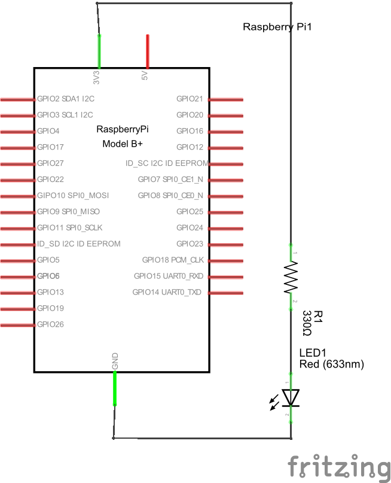
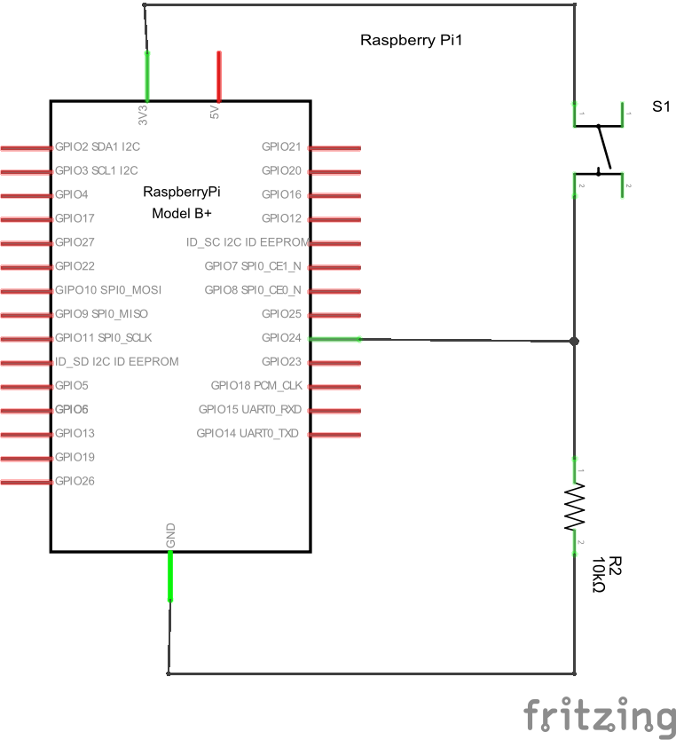
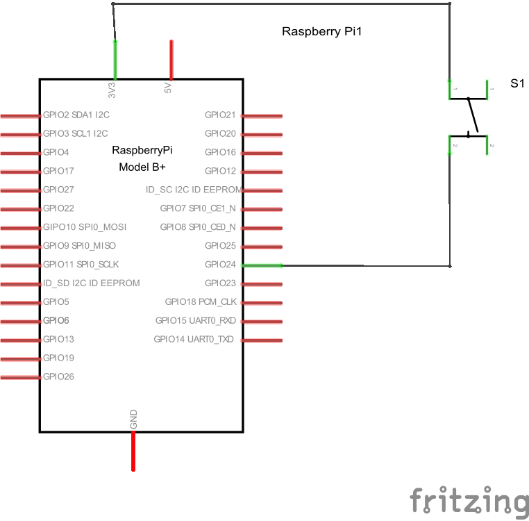
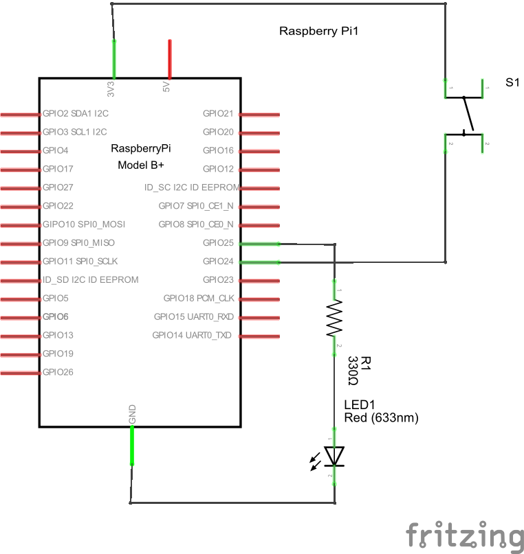

# LED

## 点灯

1番ピン（+3.3V）→LEDアノード（長い足）→LEDカソード→330Ω（橙橙茶金）→6番ピン（GND）



（図は[Fritzing](http://fritzing.org/home/)で描いた。）

## 操作（シェル）

22番ピン（GPIO 25）→LEDアノード（長い足）→LEDカソード→330Ω（橙橙茶金）→6番ピン（GND）


GPIO 25を利用可能にし、出力用にする。

```bash
sudo su
echo 25 > /sys/class/gpio/export
echo out > /sys/class/gpio/gpio25/direction
```

オン

```bash
echo 1 > /sys/class/gpio/gpio25/value
```

オフ

```bash
echo 0 > /sys/class/gpio/gpio25/value
```

点滅

```bash
while :
do
  echo 1 > /sys/class/gpio/gpio25/value
  sleep 1
  echo 0 > /sys/class/gpio/gpio25/value
  sleep 1
done
```

利用終了

```bash
echo 25 > /sys/class/gpio/unexport
exit
```

## 操作（Python）

```python:led2.py
import RPi.GPIO as GPIO
from time import sleep

GPIO.setmode(GPIO.BCM)
GPIO.setup(25, GPIO.OUT)

try:
  while True:
    GPIO.output(25, GPIO.HIGH)
    sleep(0.1)
    GPIO.output(25, GPIO.LOW)
    sleep(0.1)
except KeyboardInterrupt:
  pass

GPIO.cleanup()
```

## タクトスイッチ



```python:tact.py
import RPi.GPIO as GPIO
from time import sleep

GPIO.setmode(GPIO.BCM)
GPIO.setup(24, GPIO.IN)

try:
  while True:
    if GPIO.input(24) == GPIO.HIGH:
      print("ON")
    else:
      print("OFF")
    sleep(0.1)
except KeyboardInterrupt:
  pass

GPIO.cleanup()
```

## タクトスイッチ＋プルダウン抵抗



```python:tact-pulldown.py
import RPi.GPIO as GPIO
from time import sleep

GPIO.setmode(GPIO.BCM)
GPIO.setup(24, GPIO.IN, pull_up_down = GPIO.PUD_DOWN)

try:
  while True:
    if GPIO.input(24) == GPIO.HIGH:
      print("ON")
    else:
      print("OFF")
    sleep(0.1)
except KeyboardInterrupt:
  pass

GPIO.cleanup()
```

## タクトスイッチ + LED

optional:タクトスイッチの動作確認のために、スイッチを押すとLEDが光る単純な回路を作ってみる。

その後で、スイッチが押されているかどうかをRaspberry Piで判断するような回路を作る。（この後でトグルスイッチを作る準備である。）



```python:tact-led.py
import RPi.GPIO as GPIO
from time import sleep

GPIO.setmode(GPIO.BCM)
GPIO.setup(24, GPIO.IN, pull_up_down = GPIO.PUD_DOWN)
GPIO.setup(25, GPIO.OUT)

try:
  while True:
    if GPIO.input(24) == GPIO.HIGH:
      GPIO.output(25, GPIO.HIGH)
    else:
      GPIO.output(25, GPIO.LOW)
    sleep(0.01)
except KeyboardInterrupt:
  pass

GPIO.cleanup()
```

## トグルスイッチ

```python:toggle.py
import RPi.GPIO as GPIO
from time import sleep

GPIO.setmode(GPIO.BCM)
GPIO.setup(25, GPIO.OUT, initial = GPIO.LOW)
GPIO.setup(24, GPIO.IN, pull_up_down = GPIO.PUD_DOWN)

ledState = False

try:
  while True:
    if GPIO.input(24) == GPIO.HIGH:
      ledState = not ledState
      if ledState == True:
        GPIO.output(25, GPIO.HIGH)
      else:
        GPIO.output(25, GPIO.LOW)
      sleep(0.2)
    sleep(0.01)
except KeyboardInterrupt:
  pass

GPIO.cleanup()
```

## イベント

```python:event.py
import RPi.GPIO as GPIO
from time import sleep

def my_callback(channel):
  global ledState
  if channel == 24:
    ledState = not ledState
    if ledState == True:
      GPIO.output(25, GPIO.LOW)
    else:
      GPIO.output(25, GPIO.HIGH)

GPIO.setmode(GPIO.BCM)
GPIO.setup(25, GPIO.OUT, initial = GPIO.LOW)
GPIO.setup(24, GPIO.IN, pull_up_down = GPIO.PUD_DOWN)
GPIO.add_event_detect(24, GPIO.RISING, callback = my_callback, bouncetime = 200)

ledState = False

try:
  while True:
    sleep(0.01)
except KeyboardInterrupt:
  pass

GPIO.cleanup()
```
