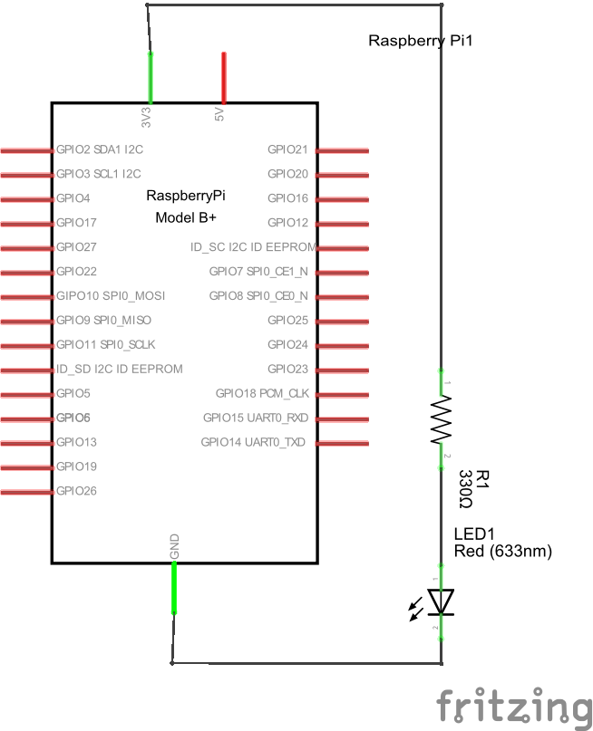
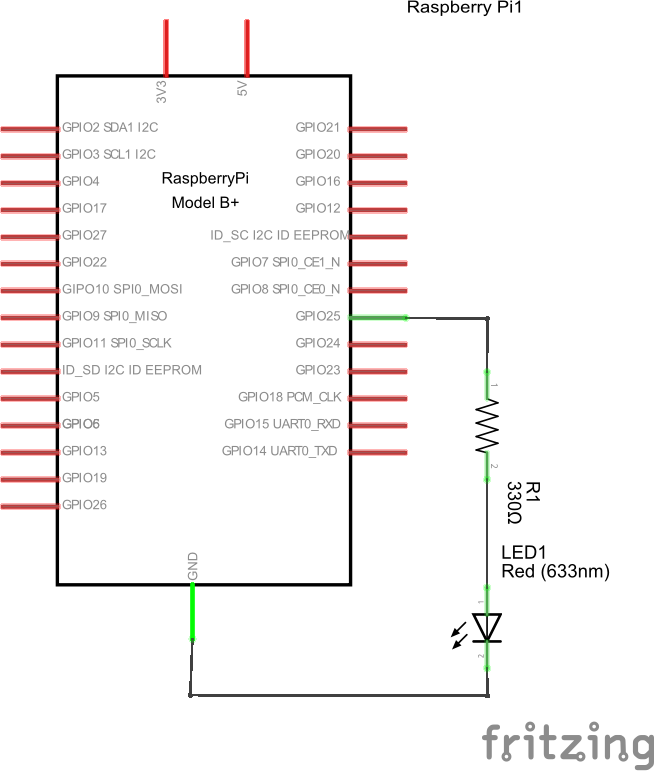
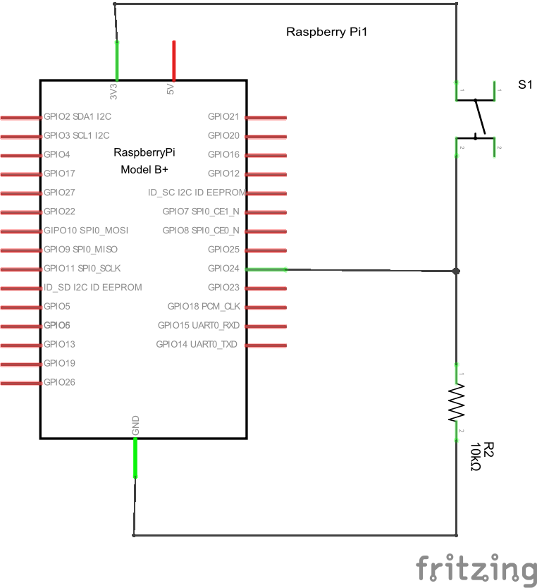
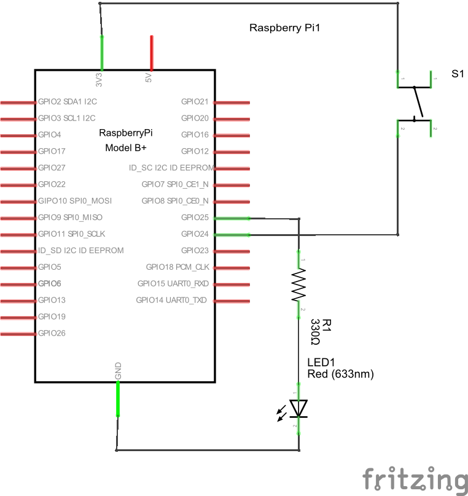

# LED

## 点灯



[Fritzing](http://fritzing.org/home/)を使ってブレッドボード用の回路図を描いてみる。

## 操作（シェル）



GPIO 25の利用を開始する。

```sh
echo 25 > /sys/class/gpio/export
```

出力用にする。

```sh
echo out > /sys/class/gpio/gpio25/direction
```

オン

```bash
echo 1 > /sys/class/gpio/gpio25/value
```

オフ

```sh
echo 0 > /sys/class/gpio/gpio25/value
```

点滅

```sh
while :
do
  echo 1 > /sys/class/gpio/gpio25/value
  sleep 1
  echo 0 > /sys/class/gpio/gpio25/value
  sleep 1
done
```

利用終了

```sh
echo 25 > /sys/class/gpio/unexport
```

## 操作

```sh
sudo python led2.py
```

## タクトスイッチ

**LEDを光らせた回路はそのままにしておいてよい。**



GPIO 24でスイッチの状態を読み取る。

```sh
echo 24 > /sys/class/gpio/export
```

```sh
echo in > /sys/class/gpio/gpio24/direction
```

```sh
cat /sys/class/gpio/gpio24/value
```

スイッチを離した状態では0に、押した状態では1になる。

```sh
echo 24 > /sys/class/gpio/unexport
```

Pythonで試す。

```sh
sudo python tact.py
```

## タクトスイッチ＋プルダウン抵抗


```sh
sudo python tact-pulldown.py
```

## タクトスイッチ + LED

1. タクトスイッチの動作確認のために、スイッチを押すとLEDが光る単純な回路を作ってみる。
1. スイッチが押されているかどうかをRaspberry Piで判断するような回路を作る。（この後でトグルスイッチを作る準備である。）



```sh
sudo python tact-led.py
```

## トグルスイッチ

```sh
sudo python toggle.py
```

## イベント

```sh
sudo python event.py
```
